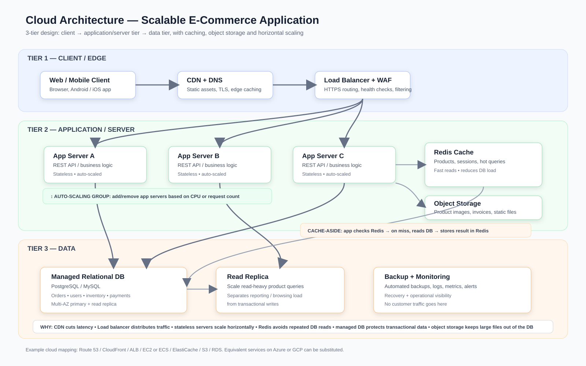

# E-Commerce Cloud Architecture

A 3-tier cloud architecture design for a scalable, secure, and highly available e-commerce application.

## Architecture

## 3-Tier Design

### 1. Client / Edge Layer
- Web browser and mobile application are the clients.
- Route 53 provides DNS routing.
- CloudFront acts as the CDN and caches static content close to users.

**Why?** The CDN reduces latency and reduces traffic reaching the application servers.

### 2. Application / Server Layer
- AWS WAF filters malicious web traffic.
- Application Load Balancer distributes requests across healthy application servers.
- EC2/ECS application servers run the business logic.
- Auto Scaling adds or removes application servers according to traffic.
- Redis/ElastiCache stores frequently accessed data.

**Why?** Stateless application servers can scale horizontally. The load balancer prevents a single server from becoming a bottleneck, while Redis reduces repeated database queries.

### 3. Data Layer
- Amazon RDS stores transactional data such as users, products, orders, inventory, and payments.
- A read replica handles read-heavy workloads.
- Amazon S3 stores product images, documents, and other large objects.

**Why?** Transactional data needs a reliable relational database, while large files are better kept in object storage.

## Request Flow

1. User opens the e-commerce application.
2. Route 53 resolves the domain.
3. CloudFront serves cached/static content or forwards dynamic requests.
4. AWS WAF checks the request.
5. Application Load Balancer sends the request to a healthy application server.
6. The application checks Redis first.
7. On a cache miss, the application reads from RDS.
8. The response is returned to the user.

## Scaling and Caching

- **CloudFront:** scales content delivery globally.
- **Application Auto Scaling:** adds/removes application servers based on traffic.
- **RDS Read Replica:** handles additional read traffic.
- **S3:** scales storage for large objects.
- **CloudFront + Redis:** provide caching at the edge and application layers.

## Availability and Recovery

- Multiple application servers avoid dependence on one server.
- RDS can use Multi-AZ deployment.
- Automated backups support recovery.
- CloudWatch provides monitoring, metrics, and alerts.
- CloudTrail provides audit logging.

## Example AWS Services

| Component | AWS Service |
|---|---|
| DNS | Route 53 |
| CDN | CloudFront |
| Web protection | AWS WAF |
| Load balancing | Application Load Balancer |
| App servers | EC2 / ECS |
| Auto scaling | EC2 Auto Scaling / ECS Service Auto Scaling |
| Cache | ElastiCache for Redis |
| Relational DB | Amazon RDS |
| Object storage | Amazon S3 |
| Monitoring | CloudWatch |
| Audit logs | CloudTrail |
| Backup | AWS Backup |

## Design Goals

Scalability • High availability • Low latency • Security • Separation of concerns • Database protection • Cost-aware scaling

> This is an architecture/design project; it does not require a deployed AWS environment.
